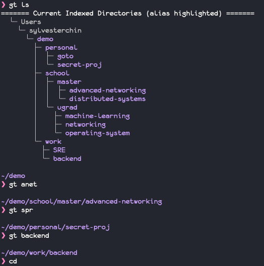

# goto (gt)

[](https://github.com/slai11/goto/actions)
[](https://crates.io/crates/goto-rs)
[](https://opensource.org/licenses/MIT)


*gt* is a simple and user-friendly way to jump to your indexed directories.

*gt* is short for "goto", which is basically what you want to do with minimal
keystrokes.

## Features

* Convenient syntax `gt XXX` to jump to XXX's path
* Easy indexing of sub-directories by using `gt add -a`
* Pretty tree-like index listing using `gt ls`

## Demo




## Installation 

Step 1. Getting the binary
```
wget https://github.com/slai11/goto/releases/download/v0.2.3/goto-rs-v0.2.3-x86_64-apple-darwin.tar.gz
tar -xvf goto-rs-v0.2.3-x86_64-apple-darwin.tar.gz 
cp goto-rs-v0.2.3-x86_64-apple-darwin/goto-rs /usr/local/bin
```

Step 2. Setting up your bash/zsh
Paste `eval "$(goto-rs init)"` in your bashrc or zshrc.

The binary's name is `goto-rs` while the command you should be using is `gt`.

A shell-based workaround inspired by https://github.com/ajeetdsouza/zoxide and
https://github.com/gsamokovarov/jump is used as it is not possible to change the
working directory of your shell programmatically. The awkward naming of the
binary is due to lack of namespace.

Coming Soon: Brew install!

## Command-Line Options

```
❯ gt help
gt

USAGE:
    goto-rs [name]... [SUBCOMMAND]

FLAGS:
    -h, --help       Prints help information
    -V, --version    Prints version information

ARGS:
    <name>...    Refers to name of index. Must be specific for now.

SUBCOMMANDS:
    add      Add directories and sub-directories to index.
    help     Prints this message or the help of the given subcommand(s)
    init     Initialises bash-script and database.
    ls       List all indexed directories.
    prune    Removes invalid indexes in the database.
    rm       Remove directories and sub-directories to index.

```


## Guide 

#### Jumping to an indexed directory
Use `gt <PATH>` to jump to your desired folder. The `<PATH>` is the folder name.
For example to jump to `Users/xxx/project/personal`, the command `gt personal`
will change your shell directory to the desired path.

#### Indexing a directory
To add the current working directory into your indexs:
```
gt add
```

To add the current directory with its subdirectories (`-a` for all subdirectories):

```
gt add -a
```

To add multiple levels of subdirectory, use the following command, where `n` is
the levels of subdirectories to add.
```
gt add -r n
```

#### List indexed directories
If you wish to list and inspect your current indexed directories. 
```
gt ls
```

#### Cleaning up index to ensure all paths are valid
Use `gt prune` to update and remove non-existent directories.


#### Removing indexes
Removing indexes works the same way as `gt add` but in the reverse manner.

To remove the directory you are in from the indexes:
```
gt rm
```

To remove the current directory with its subdirectories:
```
gt rm -a
```

To add multiple levels of subdirectory, use the following command, where `n` is
the levels of subdirectories to add.
```
gt rm -r n
```

