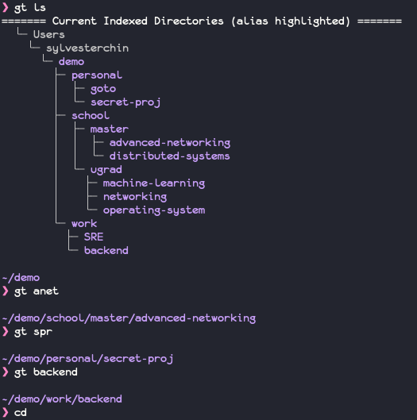

# goto (gt)

[](https://github.com/slai11/goto/actions)
[](https://crates.io/crates/goto-rs)
[](https://opensource.org/licenses/MIT)


*gt* is a zsh-friendly directory jumper that learns where you go and gets you
back there quickly.

*gt* is short for "goto", which is basically what you want to do with minimal
keystrokes.

## Features

* Automatic learning from normal `cd` usage in zsh
* Multi-term matching against aliases and full paths
* Frecency-based ranking, with recent-only views when needed
* Manual indexing tools for bootstrapping and curated aliases
* Pretty tree-like index listing using `gt ls`

## Demo




## Installation 

Step 1. Getting the binary
```
wget https://github.com/slai11/goto/releases/download/v0.4.0/goto-rs-v0.4.0-x86_64-apple-darwin.tar.gz
tar -xvf goto-rs-v0.4.0-x86_64-apple-darwin.tar.gz
cp goto-rs-v0.4.0-x86_64-apple-darwin/goto-rs /usr/local/bin
```

Or you could clone the project and build from source. You will need rust (`brew
install rust`) to do so.
```
git clone https://github.com/slai11/goto.git
cd goto 
cargo build --release
cp target/release/goto-rs /path/to/modules/
```

Step 2. Setting up zsh
Paste `eval "$(goto-rs init)"` in your `.zshrc`.

The binary's name is `goto-rs` while the command you should be using is `gt`.

A shell-based workaround inspired by https://github.com/ajeetdsouza/zoxide and
https://github.com/gsamokovarov/jump is used as it is not possible to change the
working directory of your shell programmatically. The awkward naming of the
binary is due to lack of namespace.

The zsh hook records every directory you visit, including normal `cd` usage, so
the tool learns automatically over time.

## Command-Line Options

```
❯ gt --help
Usage: goto-rs [query]... [COMMAND]

Commands:
  init    Initialises bash-script and database.
  ls      List all indexed directories.
  prune   Removes invalid indexes in the database.
  add     Add directories and sub-directories to index.
  rm      Remove directories and sub-directories to index.
  jump    List learned folders ordered by frecency or recency.
  search  Launches interactive select list.
  help    Print this message or the help of the given subcommand(s)

Arguments:
  [query]...  Directory query terms matched against alias and path.

Options:
  -h, --help     Print help
  -V, --version  Print version
```


## Guide 

#### Learning directories automatically
After adding `eval "$(goto-rs init)"` to your `.zshrc`, `gt` learns from normal
shell navigation. Every time you change directories in zsh, the destination is
recorded automatically.

That means both of the following train the database:
```
cd ~/work/project-a
gt project a
```

#### Jumping to a directory
Use one or more query terms with `gt`:
```
gt personal
gt client beta
gt proj api
```

Queries are matched against both the stored alias and the full path, then ranked
by match quality and frecency.

#### Interactive search
Use `gt` with no arguments to open the interactive selector:
```
gt
```

You can also pre-filter the selector with query terms:
```
gt search client beta
```

#### Recent and frequent jumps
To inspect learned directories ordered by frecency:
```
gt jump
```

To jump to a numbered result:
```
gt jump 3
```

To order by pure recency instead:
```
gt jump --recent
```

#### Indexing a directory
Automatic learning is the default, but manual indexing is still useful for
bootstrapping or adding directories you have not visited yet.

To add the current working directory into your indexes:
```
gt add
```

To add the current directory with its subdirectories (`-a` for all subdirectories):

```
gt add -a
```

To add multiple levels of subdirectory, use the following command, where `n` is
the levels of subdirectories to add.
```
gt add -r n
```

#### List indexed directories
If you wish to list and inspect your current indexed directories:
```
gt ls
```

#### Cleaning up index to ensure all paths are valid
Use `gt prune` to update and remove non-existent directories.


#### Removing indexes
Removing indexes works the same way as `gt add` but in the reverse manner.

To remove the directory you are in from the indexes:
```
gt rm
```

To remove the current directory with its subdirectories:
```
gt rm -a
```

To remove multiple levels of subdirectory, use the following command, where `n`
is the number of levels to remove.
```
gt rm -r n
```
